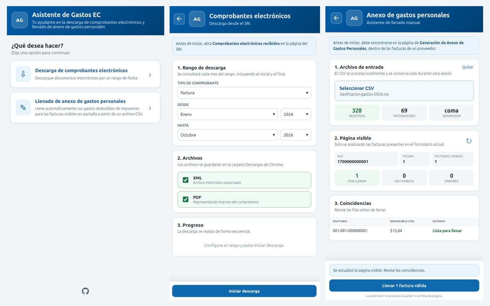

# Asistente de Gastos EC - extensión de navegador




La extensión ofrece dos herramientas desde su pantalla inicial:

- **Descarga de comprobantes electrónicos desde el SRI:** Descarga tus Comprobantes electrónicos recibidos en formato XML y PDF según un rango de tiempo asignado.
- **Llenado de anexo de gastos personales del SRI:** Completa los campos deducibles de tus facturas a partir de un CSV.

La extensión funciona únicamente en las páginas del SRI indicadas en esta guía. Sus funciones de llenado y descarga no funcionan en páginas de otros sitios web.

Es una herramienta desarrollada de forma independiente, sin afiliación ni respaldo del Servicio de Rentas Internas (SRI).
Su propósito es facilitar la gestión de comprobantes y gastos personales para el cumplimiento de las obligaciones tributarias a lo largo del año.

## Instalación

### Desde Chrome Web Store

1. Abra [Asistente de Gastos EC en Chrome Web Store](https://chromewebstore.google.com/detail/asistente-de-gastos-ec/njhbeoljcleacjocmidimbmdebmmnjoc).
2. Pulse **Añadir a Chrome** y confirme la instalación.
3. Fije la extensión **Asistente de Gastos EC** a la barra del navegador para un fácil acceso.

### Desde el código fuente (para desarrollo)

Esta opción permite probar o modificar la extensión durante el desarrollo.

1. Clone el repositorio o descargue el código como ZIP y descomprímalo.
2. Abra `chrome://extensions` en Chrome.
3. Active **Modo de desarrollador**.
4. Pulse **Cargar descomprimida**.
5. Seleccione la carpeta que contiene este proyecto.
6. Fije la extensión **Asistente de Gastos EC** a la barra del navegador para un fácil acceso.

Después de modificar el código, pulse **Recargar** en la tarjeta de la extensión y recargue la página del SRI para aplicar los cambios.

### Permisos

La extensión solicita acceso solamente a:

```text
https://sriservicios.sri.gob.ec/*
https://srienlinea.sri.gob.ec/*
```

También solicita el permiso de Chrome **Administrar tus descargas** para asignar a cada XML/PDF el nombre del comprobante.

## Descargar comprobantes electrónicos

### Flujo de trabajo

1. Inicie sesión en el SRI y abra **Facturación electrónica** -> **Comprobantes electrónicos recibidos**.
2. Abra la extensión y seleccione **Descarga de comprobantes electrónicos**.
3. Seleccione el tipo de comprobante, el rango de tiempo, y los tipos de archivo a descargar.
4. Presione **Iniciar descarga** para comenzar. Mantenga abierta la pestaña del navegador mientras se descargan los archivos.

Los archivos se guardan directamente en la carpeta Descargas configurada en Chrome, con nombres como:

```text
Factura_001-001-000000001.xml
Factura_001-001-000000001.pdf
```

## Llenar anexo de gastos personales

Para el llenado del anexo de gastos personales necesita cargar un CSV con la información de gastos personales por proveedor, factura y categoría.
Es 100% compatible con el archivo CSV generado por la aplicación [Analizador de facturas](https://github.com/RogerVega33/analizador-de-facturas-deploy).

### Formato del CSV

Todas las columnas son obligatorias.

```csv
ruc_proveedor,numero_factura,alimentacion,educacion,salud,vestimenta,vivienda,turismo
1790000000001,001-001-000000001,12.50,0.00,0.00,0.00,0.00,0.00
```

El encabezado debe contener exactamente esos nombres y en ese orden. También se aceptan CSV separados por punto y coma o tabulador, números de factura sin guiones e importes con coma decimal.

### Flujo de trabajo

1. Inicie sesión en el SRI y abra **Anexos** -> **Anexo de gastos personales en línea** -> **Generación de anexos**.
2. Ingrese al período del anexo -> **Facturas electrónicas** -> Seleccione un proveedor -> Se listarán las facturas del proveedor.
3. Abra la extensión y seleccione **Llenado de anexo de gastos personales**.
4. Cargue el archivo CSV de sus gastos personales.
5. Revise las coincidencias de la página visible.
6. Pulse **Llenar** para llenar los campos de la página visible.
7. Revise en la página los campos completados.
8. Pulse **Guardar** en la página del SRI si los valores son correctos.
9. Pulse **Siguiente** en la página del SRI para avanzar a la próxima página. La extensión detectará el cambio y volverá a analizar las facturas de la lista.

### Controles de seguridad

- Para encontrar una factura y llenar su información se necesita contar con el RUC y el número de factura exactos.
- Una factura duplicada en el CSV impide cargar el archivo.
- Si la suma de deducibles supera el máximo disponible mostrado por el SRI, verá un error y no se llenarán los deducibles de esa factura.
- El CSV se guarda en `chrome.storage.session`: permanece en memoria durante la sesión del navegador y no se sincroniza ni se envía a servidores externos.

## Licencia

Copyright 2026 Roger Vega.

Este proyecto se distribuye bajo la [Apache License 2.0](LICENSE). Consulta también el archivo de [atribuciones](NOTICE). Las dependencias de terceros conservan sus respectivas licencias.
